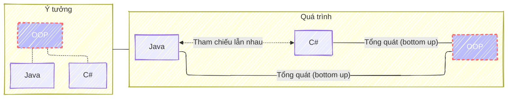
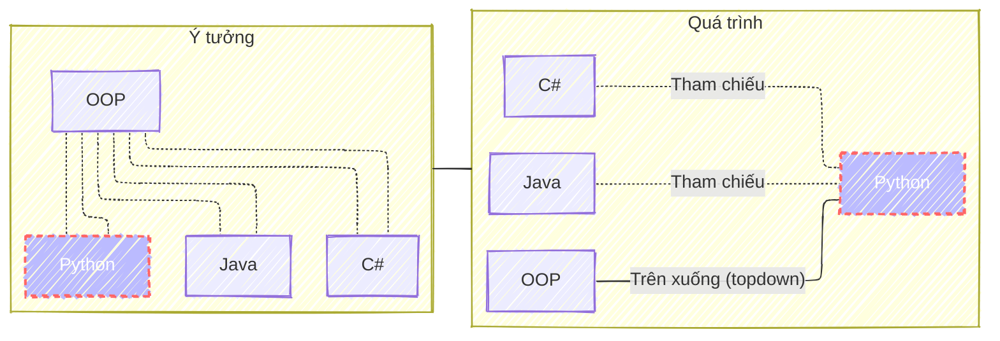
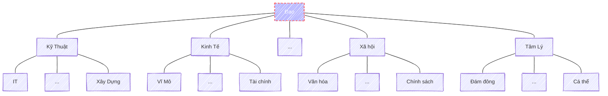

> <cite>
<a target="_blank" href="https://dongxiyuan.artron.net/works_detail_brt000790000262">
董希源《盤垣古樹縁映天》- Đổng Tây Nguyên《Cổ thụ phản chiếu bầu trời》
</a>
</cite>

*Musk: One bit of advice: it is important to view knowledge as sort of a semantic tree — make sure you understand the fundamental principles, ie the trunk and big branches, before you get into the leaves/details or there is nothing for them to hang on to.*

> <cite><a target="_blank" href="https://fs.blog/elon-musk-knowledge/">
Elon Musk on How To Build Knowledge
</a></cite>

## Tính chất
Càng ở nhánh thì càng chi tiết. Càng lên cào thì càng trừu tượng, và tổng quát.\
Các nhánh con thì có những điểm chung và được tổng quát dần lên nhánh cha.

Cha con chỉ mang tính chất tương đối, và không chỉ có 1 cây duy nhất.\
Một nhánh con bên này có thể chung tính chất với 1 nhánh nào ở bên kia.\
Như vậy bọn chúng có thế chung một nhánh ở một cây khác. Cái này khá giống khái niệm chiều không gian song song.

Mục tiêu của người là càng lên cao càng tốt.\
Hoặc phủ càng nhiều càng tốt, tuy nhiên phủ nhiều ở lá mà không đi được lên cao thì cũng nguy hại đối với việc phát triển tư duy kiến thức.

Dưới đây là một số phương pháp có thể được dùng để bao phủ hay tiến tới mục tiêu.

## Tổng quá hóa (Bottom up)
Đây là phương pháp mà hay được áp dụng vào những năm đầu đi học khi người học chưa hề biết gì. Lúc này mọi kiến thức đều là mới. Quá trình này hầu hết mọi người đều rất quen thuộc và cũng rất ngán, vì nó là quá trình học cày ải. Đối với những người trẻ với việc học là ưu tiên số một thì đây là chuyện chấp nhận được.\
Tuy nhiên, với những người đã có công việc, việc phải học cái mới theo phương pháp này luôn là sự đánh đổi giữa trạng thái an toàn, và sự kỷ luật, cày ải của bản thân.

Một số lưu ý cần nhớ:
- Nhớ rằng cậu đang ở các nút lá, cố gắng tìm ra mục tiêu là nút cha phía trên, đừng để những chi tiết làm mờ đi mục tiêu tổng quát hóa cuối cùng.
- Để tổng quát hóa lên có thể cần phải tìm hiểu nhiều hơn 1 nút lá.
- <a target="_blank" href="https://martinfowler.com/bliki/ShuHaRi.html">Shu Ha Ri</a>: giúp cậu hiểu được quá trình theo từng giai đoạn một cách cụ thể.
- <a target="_blank" href="https://wei-he.xyz/5w">5W (Why --> How, What --> When, Where)</a>: giúp cậu tìm ra cấu trúc định hình ra được những kiến thức nào cần phải chú ý, cần phải nhớ và có thể quên trong suốt quá trình học.

*Ví dụ tổng quá hóa đc OOP, cậu có thể học trước với Java và C# rồi sau đó tổng quát hóa nó lên thành OOP.*

## Trên xuống (Top down)
Để học hay tìm hiểu 1 kiến thức mới, nếu may mắn bạn có thể áp dụng phương pháp top down. Thông thường đây là quá trình được diễn ra, hay thành qua đạt được sau khi bạn tổng quá hóa thành công. Đây là phương pháp rất phổ biến với những người đã học xong một chuyên môn nào đó và có đủ kinh nghiệm. Quá trình học một cái mới là quá trình gồm 2 bước chính:

- Dùng những kiến thức đã biết để tổng quát hóa lên nhánh cha (bottom up).
- Dùng kiến thức tổng quát đã được xây dựng và kiến thức chi tiết đã biết để liên hệ khi học một nhánh mới.

*Ví dụ để học mới Python, sau khi đã biết OOP và Java, C#. Trong quá trình học Python, có thể dùng Java hay C# là tham chiếu.*

## Tương phản (Jump)
Nếu với topdown và bottom up cậu sẽ mở rộng hay phát triển kiến thức ở gần mình. Mình sẽ là chuyên gia trong lĩnh vực của mình. Thì với tương phản, cậu sẽ chủ động mở rộng được kiến thức ở một nhánh cây hoàn toàn mới. Việc này sẽ giúp cậu không rơi vào trạng thái Tối ưu hóa cục bộ (local optimize). Mà sẽ giúp cho cậu có một cái nhìn nhiều chiều hơn một vấn đề nào đấy.

Tuy nhiên đây là một phương pháp nguy hiểm, vì nó không chỉ đòi hỏi nhiều thời gian công sức. Mà có thể dẫn người học tới trạng thái không có gì ra hồn (Một nghề cho chín còn hơn chín nghề). Không chỉ vậy nó còn đòi hỏi cậu tại một số thời điểm quên đi những gì mình đã biết, và mình được dạy để có thể tiếp nhận được cái mới. Đây là một kỹ thuật khó nó trái ngược hoàn toàn với phản ứng tự nhiên của người học khi dùng những kiến thức đã biết để liên hệ lại (top down approach). Câu nói nổi tiếng giải thích phương pháp này đó là <a target="_blank" href="https://www.oreilly.com/library/view/apprenticeship-patterns/9780596806842/ch02.html">Emptying the Cup</a>

Thế nên tớ nghĩ phương pháp này chỉ phù hợp với những ai đã có một kiến thức nền nhất định và có ước muốn và động lực để tìm hiểu cái mới.

Tuy nhiên thành quả nhận lại sẽ rất tuyệt, cậu sẽ hiểu hơn về Đạo. Cậu sẽ tìm được sự cân bằng và một góc nhìn đa chiều hơn đối với 1 vấn đề cụ thể. Có thể thực hành được phương pháp này khả năng để thấy được đường mòn của Đạo sẽ cao hơn ^^. 

## Kết
Mỗi người đều có cho mình một hoặc nhiều cây kiến thức khác nhau. Mong cậu đừng trở thành 1 con người bảo thủ, phiến diện hoặc ngược lại cái gì cũng biết mà thực ra là chả biết gì. Đó chính là đi loanh quanh, luẩn quẩn trên đường của Đạo. 

Hy vọng là cậu sẽ nhìn thấy, xây dựng được cây kiến thức của riêng mình. Cây đó chính là bản đồ trên con đường mòn của Đạo.