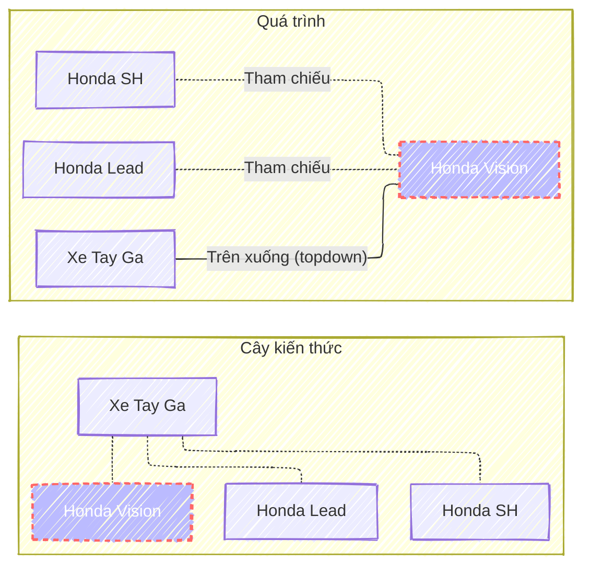
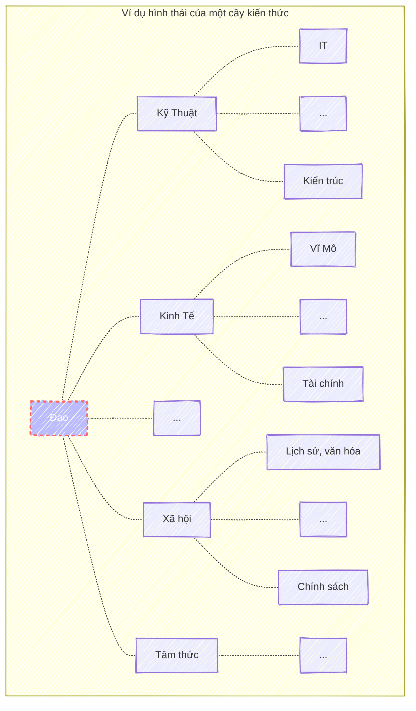

Musk: One bit of advice: it is important to view knowledge as sort of a semantic tree — make sure you understand the fundamental principles, (i.e. the trunk and big branches), before you get into the leaves/details or there is nothing for them to hang on to.
{: .notice--warning .text-justify}

> <cite><a target="_blank" href="https://fs.blog/elon-musk-knowledge/">
Elon Musk on How To Build Knowledge
</a></cite>

> <cite>
<a target="_blank" href="https://dongxiyuan.artron.net/works_detail_brt000790000262">
董希源《盤垣古樹縁映天》- Đổng Tây Nguyên《Cổ thụ phản chiếu bầu trời》
</a>
</cite>

## Tính chất
Kiến thức càng đi sâu xuống dưới càng chi tiết cụ thể, ngược lại càng trở nên trừu tượng và tổng quát hơn khi đi lên cao.
Các nhánh con có đặc tính chia sẻ những điểm chung và dần được tổng quát hóa khi đi lên nhánh cha.
{: .text-justify}

Mối quan hệ cha - con chỉ mang tính tương đối và không chỉ tồn tại một cây kiến thức duy nhất.
Một nhánh con bất kỳ có thể có những đặc điểm chung với một nhánh khác thuộc một cây kiến thức khác.
{: .text-justify}

Dưới đây là một số phương pháp có thể được sử dụng để bao phủ và từng bước khám phá cây kiến thức.
{: .text-justify}

## Tổng quát hóa (Bottom up)
Đây là phương pháp thường được áp dụng trong những năm đầu học tập, khi người học chưa có kiến thức nền tảng.
Lúc này, mọi thông tin đều mới mẻ.
{: .text-justify}

Quá trình này quen thuộc với hầu hết mọi người vì nó là cách học phổ biến ở trường học.
Đối với những người trẻ tuổi, việc học là ưu tiên hàng đầu nên phương pháp này hoàn toàn phù hợp.
Tuy nhiên, với những người đã đi làm, việc học kiến thức mới theo cách này thường là sự đánh đổi giữa sự an toàn, 
thoải mái hiện tại với những khó khăn và đôi khi là sự hoang mang khi đối diện với điều chưa biết.
{: .text-justify}

Một số điểm cần lưu ý:
- Hãy nhớ rằng cậu đang bắt đầu từ những kiến thức cụ thể (các nút lá). Cố gắng xác định mục tiêu là những kiến thức tổng quát hơn (các nút phía trên) và đừng để những chi tiết phức tạp làm xao nhãng mục tiêu tổng quát hóa cuối cùng.
- <a target="_blank" href="/shu-ha-ri">Shu Ha Ri</a>: Mô hình này giúp cậu hiểu rõ quá trình học tập theo từng giai đoạn cụ thể.
- <a target="_blank" href="/5w1h">5W1H (Why --> [How, What] --> [When, Where])</a>: Phương pháp này giúp cậu xác định những kiến thức nào cần chú ý, cần ghi nhớ và những kiến thức nào có thể bỏ qua trong quá trình học.
{: .text-justify}

Ví dụ, sau khi cậu đã học cách sửa chữa các dòng xe tay ga cụ thể như Lead, SH, cậu có thể tổng quát hóa kiến thức đó thành kiến thức chung về "Sửa chữa xe tay ga".
{: .text-justify}

## Trên xuống (Top down)
Nếu may mắn, cậu có thể áp dụng phương pháp tiếp cận từ trên xuống để học hoặc tìm hiểu một kiến thức mới.
Thông thường, đây là kết quả đạt được sau khi cậu đã tổng quát hóa kiến thức thành công.
{: .text-justify}

Phương pháp này rất phổ biến với những người đã hoàn thành một chuyên môn nhất định và có đủ kinh nghiệm.
Họ có thể sử dụng kiến thức tổng quát đã xây dựng và kiến thức chi tiết đã biết để liên hệ khi học một lĩnh vực mới.
{: .text-justify}

Chẳng hạn, để học cách sửa chữa một loại xe mới như Vision, sau khi cậu đã có kiến thức về sửa chữa xe tay ga nói chung và kinh nghiệm sửa chữa Lead, SH nói riêng.
{: .text-justify}

## Nhảy (Jump)
Nếu phương pháp đi từ trên xuống và từ dưới lên giúp cậu mở rộng và phát triển kiến thức trong phạm vi gần với những gì cậu đã biết,
thì phương pháp "nhảy" cho phép cậu chủ động mở rộng kiến thức sang một lĩnh vực hoàn toàn mới.
Điều này không chỉ giúp cậu tránh rơi vào trạng thái tối ưu cục bộ mà còn mang lại cho cậu cái nhìn đa chiều hơn về một vấn đề.
{: .text-justify}

Tuy nhiên, đây là một phương pháp không dễ áp dụng vì nó đòi hỏi nhiều thời gian và công sức.
Nó cũng có thể khiến người học lạc lối và dẫn đến tình trạng học lan man, không sâu.
{: .text-justify}

Hơn nữa, phương pháp này đòi hỏi cậu đôi khi phải gạt bỏ những gì đã biết để tiếp nhận những kiến thức mới, thậm chí trái ngược hoàn toàn với những gì đã quen thuộc.
Đây là một kỹ năng khó vì nó đi ngược lại phản ứng tự nhiên của người học là liên hệ kiến thức mới với kiến thức đã có (phương pháp top-down).
Kỹ thuật <a target="_blank" href="/do-tra">Đổ Trà (Emptying the Cup)</a> có thể giúp cậu rèn luyện tư duy khi áp dụng phương pháp này.
{: .text-justify}

Vì vậy, tớ cho rằng phương pháp này chỉ phù hợp với những người đã có một nền tảng kiến thức vững chắc, có khả năng tư duy phản biện và đặc biệt là có động lực mạnh mẽ để khám phá những điều mới.
{: .text-justify}

## Kết
Hy vọng rằng cậu sẽ nhận ra và xây dựng được cây kiến thức của riêng mình, từ đó vẽ ra được bản đồ tri thức cho chính cậu.
{: .text-justify}