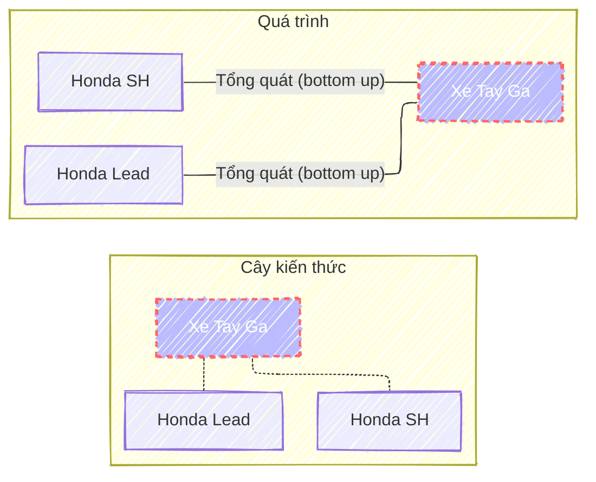
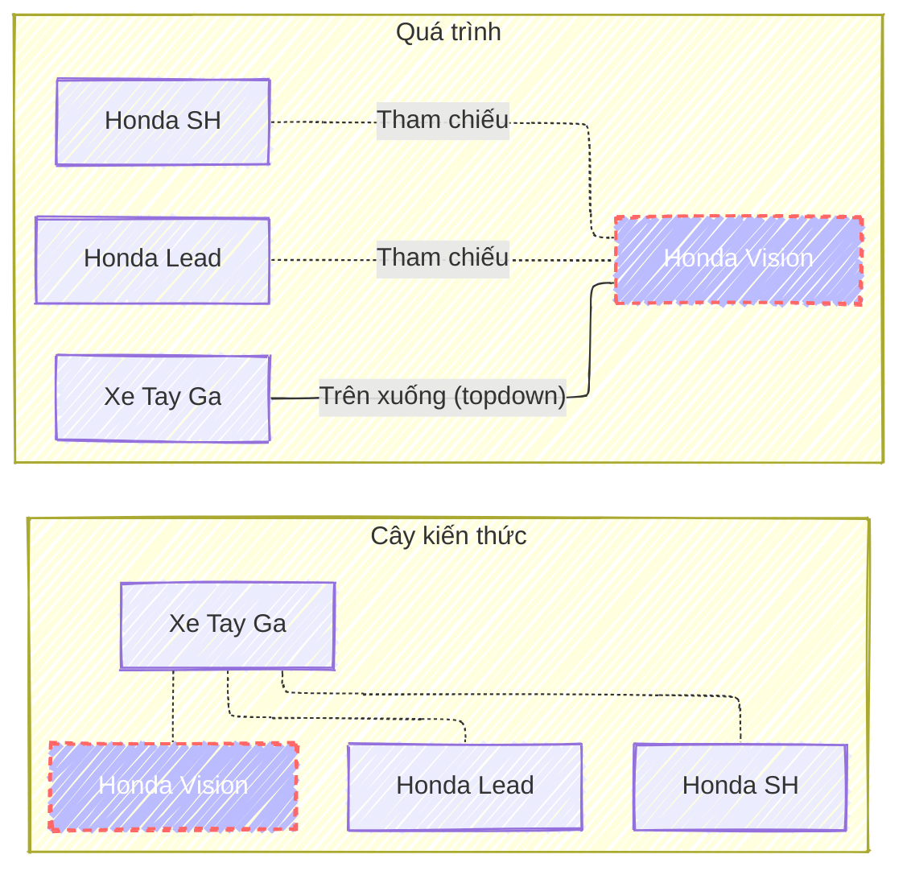
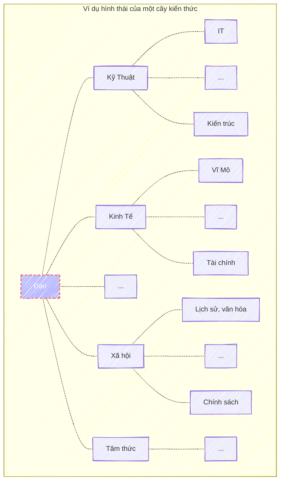

Musk: One bit of advice: it is important to view knowledge as sort of a semantic tree — make sure you understand the fundamental principles, (i.e. the trunk and big branches), before you get into the leaves/details or there is nothing for them to hang on to.
{: .notice}

> <cite><a target="_blank" href="https://fs.blog/elon-musk-knowledge/">
Elon Musk on How To Build Knowledge
</a></cite>

> <cite>
<a target="_blank" href="https://dongxiyuan.artron.net/works_detail_brt000790000262">
董希源《盤垣古樹縁映天》- Đổng Tây Nguyên《Cổ thụ phản chiếu bầu trời》
</a>
</cite>

## Tính chất
Càng xuống gần lá thì càng chi tiết. Càng lên cao thì càng trừu tượng, tổng quát.
Các nhánh con thì có những điểm chung và được tổng quát dần lên nhánh cha.
{: .text-justify}

Cha con chỉ mang tính chất tương đối, và không chỉ có một cây duy nhất.
Một nhánh con bất kỳ có thể chung tính chất với một nhánh nào đó khác trong một cây kiến thức khác.
{: .text-justify}

Dưới đây là một số phương pháp có thể được dùng để bao phủ và leo dần lên cây.
{: .text-justify}

## Tổng quát hóa (Bottom up)
Đây là phương pháp mà hay được áp dụng vào những năm đầu đi học khi người học chưa hề biết gì. Lúc này mọi kiến thức đều là mới.
Quá trình này hầu hết mọi người đều rất quen thuộc vì nó là quá trình học ở phổ thông. 
Đối với những người trẻ do việc học là ưu tiên số một nên đây là chuyện chấp nhận được. 
Tuy nhiên, với những người đã có công việc, việc phải học kiến thức mới theo phương pháp này luôn là sự đánh đổi giữa trạng thái an toàn, thoải mái với sự cực khổ đôi khi mang chút hoang mang của bản thân.
{: .text-justify}

Một số điểm cần lưu ý:
- Nhớ rằng cậu đang ở các nút lá, cố gắng tìm ra mục tiêu là các nút phía trên, đừng để những chi tiết rối rắm làm mờ đi mục tiêu tổng quát hóa cuối cùng.
- <a target="_blank" href="/shu-ha-ri">Shu Ha Ri</a>: giúp cậu hiểu được quá trình theo từng giai đoạn một cách cụ thể.
- <a target="_blank" href="/5w1h">5W1H (Why --> [How, What] --> [When, Where])</a>: giúp cậu định hình ra được những kiến thức nào cần phải chú ý, cần phải nhớ và có thể quên trong suốt quá trình học.
{: .text-justify}

*Ví dụ sửa được các xe tay ga, cậu có thể học trước với sửa 1 dòng xe cụ thể như Lead, SH rồi sau đó tổng quát hóa nó lên thành Sửa xe tay ga.*

## Trên xuống (Top down)
Để học hay tìm hiểu 1 kiến thức mới, nếu may mắn cậu có thể áp dụng phương pháp từ trên xuống. 
Thông thường đây là thành quả đạt được sau khi cậu tổng quát hóa thành công.
Đây là phương pháp rất phổ biến với những người đã học xong một chuyên môn nào đó và có đủ kinh nghiệm, 
vì chỉ cần sử kiến thức tổng quát đã được xây dựng và kiến thức chi tiết đã biết để liên hệ khi học một nhánh mới.

*Ví dụ để học sửa 1 loại xe mới như Vision, sau khi đã biết sửa xe tay ga và Lead, SH.*

## Nhảy (Jump)
Nếu với phương pháp từ trên xuống và từ dưới lên cậu sẽ mở rộng hay phát triển kiến thức ở gần mình, sẽ đạt được chuyên môn trong một số lĩnh vực nhất định. 
Thì với phương pháp nhảy, cậu sẽ chủ động mở rộng được kiến thức ở một nhánh cây hoàn toàn mới. 
Việc này không chỉ sẽ giúp cậu không rơi vào trạng thái Tối ưu cục bộ (local optimize), mà còn cho cậu có một cái nhìn nhiều chiều hơn một vấn đề nào đấy.
{: .text-justify}

Tuy nhiên đây là một phương pháp không dễ áp dụng, vì nó không chỉ đòi hỏi nhiều thời gian công sức, mà có thể dẫn người học lạc vào mê cung, dẫn tới trạng thái không có gì học ra hồn.
Không chỉ vậy nó còn đòi hỏi cậu tại một số thời điểm có thể sẽ phải quên đi những gì cậu đã biết để có thể tiếp nhận được cái mới mà có khi ngược lại hoàn toàn với cái cũ. 
Đây là một kỹ thuật khó vì nó trái ngược hoàn toàn với phản ứng tự nhiên của người học khi dùng những kiến thức đã biết để liên hệ lại (Top down). 
<a target="_blank" href="/do-tra">Đổ Trà (Emptying the Cup)</a> là kỹ thuật giúp cậu rèn luyện tư duy khi áp dụng phương pháp này.
{: .text-justify}

Thế nên tớ nghĩ phương pháp này chỉ phù hợp với những ai đã có một kiến thức nền nhất định đủ vững, có khả năng suy nghĩ phản biện và đặc biệt là có động lực để tìm hiểu cái mới.
{: .text-justify}

## Kết
Hy vọng là cậu sẽ nhìn thấy, xây dựng được cây kiến thức để từ đó vẽ ra được bản đồ cho riêng mình.
{: .text-justify}