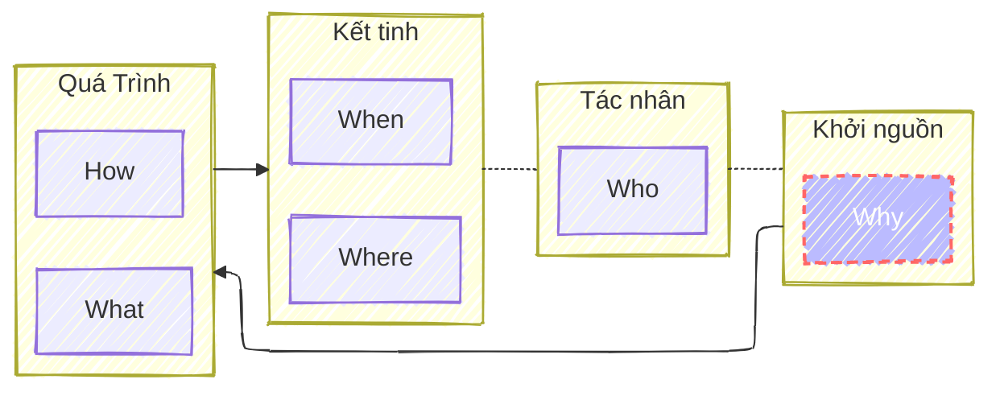

> Why --> [How, What] --> [When, Where]
{: .notice}

> <cite>
<a target="_blank" href="https://baike.baidu.com/item/%E7%8E%8B%E5%AD%90%E6%AD%A6/3688265">
王子武《李白与晁衡》- Vương Tử Ô《Lí Bạch và Abe no Nakamaro》
</a>
</cite>

## Why - Khởi nguồn
Why là câu hỏi quan trọng nhất, nó quyết định và kiểm soát tất cả mọi thứ phía sau.
{: .text-justify}

Trước khi học bất cứ điều gì, điều đầu tiên cậu cần làm rõ chính là động lực. Tại sao mình lại cần kiến thức này? Nó có thực sự giúp ích cho mình hay không? Nếu không trả lời được, rất có thể cậu đang học theo quán tính thay vì theo mục đích.
{: .text-justify}

Ngoài ra, Why còn giúp cậu nhìn rõ hơn bản chất và nguồn gốc của kiến thức. Kiến thức này được tạo ra trong hoàn cảnh nào? Vì lý do gì? Hiểu được điều này, cậu sẽ biết giới hạn của nó ở đâu, và tránh áp dụng một cách máy móc vào bối cảnh không phù hợp.
{: .text-justify}

## What & How - Quá Trình
Đây là hai câu hỏi sẽ được trả lời trong suốt quá trình tìm hiểu. Trả lời chúng, cậu sẽ đi vào chi tiết của kiến thức: khái niệm cốt lõi là gì, cách thức vận hành ra sao, làm thế nào để áp dụng, điểm mạnh và điểm yếu nằm ở đâu.
{: .text-justify}

Phần này thường tốn nhiều công sức nhất, nhưng nghịch lý ở chỗ: nó lại là phần cậu nên sẵn sàng quên đi. Hãy dùng What & How như cuốn từ điển — không ai đi học thuộc lòng cuốn từ điển bao giờ.
{: .text-justify}

## When & Where - Kết tinh
Sau khi hiểu rõ khái niệm và cách vận hành, nếu cậu không kết tinh được, tức là biết rõ khi nào dùng, hoàn cảnh nào phù hợp, thì coi như vẫn chưa thực sự làm chủ kiến thức đó.
{: .text-justify}

When và Where đặt ra cho cậu những định hướng cụ thể: khi nào thì áp dụng phương pháp này? Nó chỉ phù hợp trong hoàn cảnh nào? Đây mới là thứ đáng giữ lại sau tất cả.
{: .text-justify}

## Who - Tác nhân
Với những kiến thức kỹ thuật hay tự nhiên, câu hỏi Who hầu như không xuất hiện. Nhưng trong lĩnh vực xã hội hay kinh tế, Who lại đóng vai trò rất quan trọng: nó vừa là nhân tố tác động tới nguồn gốc vấn đề (Why), vừa là kết quả của quá trình phân tích ai sẽ làm gì, ở đâu, và như thế nào.
{: .text-justify}

```mermaid
---
config:
  layout: elk
  look: handDrawn
---

flowchart LR
  subgraph khoinguon[Khởi nguồn]
    direction LR

    Why
  end


  subgraph quatrinh[Quá Trình]
    direction LR

    How
    What
  end

  subgraph kettinh[Kết tinh]
    direction LR

    When
    Where
  end

  subgraph tacnhan[Tác nhân]
    direction LR

    Who
  end

  khoinguon --> quatrinh
  quatrinh --> kettinh
  tacnhan -.- khoinguon
  kettinh -.- tacnhan

  style Why fill:#bbf,stroke:#f66,stroke-width:2px,color:#fff,stroke-dasharray: 5 5
```

## Cái nào cần nhớ, cái nào có thể quên
Hãy giữ lại Why, When, Where trong hành lý đi tiếp trên con đường của mình. Chúng nhẹ nhất nhưng lại là những thứ quý giá nhất.
{: .text-justify}