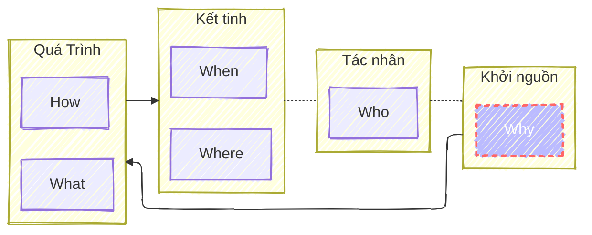

> Why --> [How, What] --> [When, Where]
{: .notice--info .text-justify}

> <cite>
<a target="_blank" href="https://baike.baidu.com/item/%E7%8E%8B%E5%AD%90%E6%AD%A6/3688265">
王子武《李白与晁衡》- Vương Tử Ô《Lí Bạch và Abe no Nakamaro》
</a>
</cite>

## Why - Khởi nguồn
Why là câu hỏi đứng trước mọi câu hỏi khác. Nó quyết định và kiểm soát tất cả những gì phía sau.
{: .text-justify}

Trước khi học bất cứ điều gì, việc đầu tiên là làm rõ **động lực**: kiến thức này để làm gì, có thực sự cần cho mình hay không. Không trả lời được câu đó thì rất có thể người ta đang học theo quán tính chứ không phải theo mục đích.
{: .text-justify}

Why còn soi rõ **nguồn gốc** của kiến thức: nó sinh ra trong hoàn cảnh nào, để giải quyết chuyện gì. Kiến thức nào cũng có gốc, mà gốc ở đâu thì giới hạn ở đó. Nắm được chỗ này, mình khỏi đem nó áp một cách máy móc vào bối cảnh không thuộc về nó.
{: .text-justify}

## What & How - Quá Trình
Đây là hai câu hỏi được trả lời dần trong suốt quá trình tìm hiểu. Chúng dẫn vào chi tiết của kiến thức: khái niệm cốt lõi là gì, vận hành ra sao, áp dụng thế nào, mạnh yếu nằm ở đâu.
{: .text-justify}

Phần này tốn công nhất, nhưng nghịch lý ở chỗ nó lại là phần nên sẵn sàng quên đi. What & How là **cuốn từ điển** – thứ để tra khi cần, chứ không ai đi học thuộc lòng cuốn từ điển bao giờ.
{: .text-justify}

## When & Where - Kết tinh
Hiểu khái niệm, nắm cách vận hành rồi mà không **kết tinh** được – không biết khi nào dùng, hoàn cảnh nào hợp – thì vẫn chưa thực sự làm chủ kiến thức đó.
{: .text-justify}

When và Where trả lời những câu rất cụ thể: lúc nào thì đem phương pháp này ra dùng, và nó chỉ đúng trong bối cảnh nào. Đây mới là thứ đáng giữ lại sau tất cả.
{: .text-justify}

## Who - Tác nhân
Với kiến thức kỹ thuật hay tự nhiên, câu hỏi Who hầu như không xuất hiện. Nhưng sang lĩnh vực xã hội hay kinh tế thì Who lại rất nặng ký: nó vừa là nhân tố tác động tới nguồn gốc vấn đề (Why), vừa là kết quả của cả quá trình phân tích – ai sẽ làm gì, ở đâu, và như thế nào.
{: .text-justify}

```mermaid
---
config:
  layout: elk
  look: handDrawn
---

flowchart LR
  subgraph khoinguon[Khởi nguồn]
    direction LR

    Why
  end


  subgraph quatrinh[Quá Trình]
    direction LR

    How
    What
  end

  subgraph kettinh[Kết tinh]
    direction LR

    When
    Where
  end

  subgraph tacnhan[Tác nhân]
    direction LR

    Who
  end

  khoinguon --> quatrinh
  quatrinh --> kettinh
  tacnhan -.- khoinguon
  kettinh -.- tacnhan

  style Why fill:#bbf,stroke:#f66,stroke-width:2px,color:#fff,stroke-dasharray: 5 5
```

## Cái nào cần nhớ, cái nào có thể quên
What và How là phần nặng nhất mà lại đáng quên nhất, vì lúc cần thì tra lại được. Còn Why, When, Where thì giữ lại trong hành lý đi tiếp trên đường của mình: chúng nhẹ nhất, mà quý nhất.
{: .text-justify}
