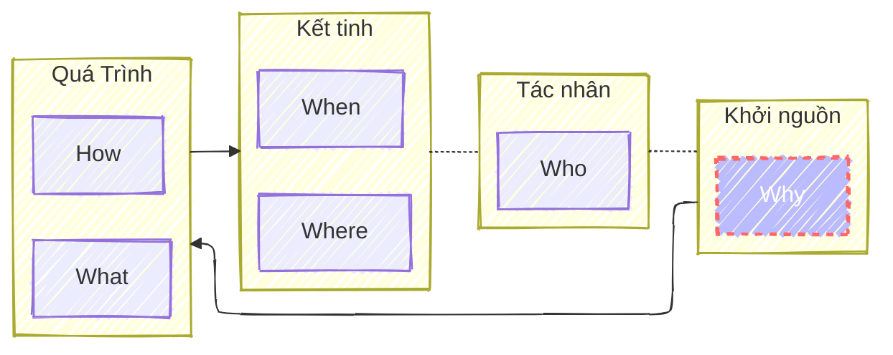

Why --> [How, What] --> [When, Where]
{: .notice}

> <cite>
<a target="_blank" href="https://baike.baidu.com/item/%E7%8E%8B%E5%AD%90%E6%AD%A6/3688265">
王子武《李白与晁衡》- Vương Tử Ô《Lí Bạch và Abe no Nakamaro》
</a>
</cite>

## Why - Khởi nguồn
Why là câu hỏi quan trọng nhất quyết định và kiểm soát tất cả mọi thứ. 

Trước khi học một cái gì đó điều quan trọng nhất luôn là động lực.
- Tại sao mình lại cần học kiến thức này? 
- Nó có giúp ích gì được cho mình hay không?

Ngoài ra câu hỏi Why còn giúp cậu định hướng rõ hơn bản chất, nguồn gốc của kiến thức. 
- Tại sao kiến thức này được tạo ra? 
- Nó tạo ra trong hoàn cảnh thế nào?

## What & How - Quá Trình
Đây là hai câu hỏi thường sẽ được trả lời trong quá trình tìm hiểu, học kiến thức. Trả lời hai câu này cậu sẽ đi vào chi tiết của kiến thức. Ví dụ như:
{: .text-justify}

- Kiến thức này cần những khái niệm gì?
- Cách thức vận hành như thế nào?
- Làm cách nào để mình có thể áp dụng được nó?
- Điểm mạnh của phương pháp này là gì?
- Phương pháp đang học có điểm yếu là gì?

## When & Where - Kết tinh
Sau khi học xong và hiểu rõ các khái niệm cũng như cách chúng vận hành, nếu cậu không kết tinh là được thì cũng coi là chưa làm chủ kiến thức.
{: .text-justify}

Với hai câu hỏi When & Where sẽ đặt ra cho cậu những định hướng cụ thể như:

- Khi nào thì mình sẽ áp dụng được phương pháp này?
- Phương pháp này chỉ phù hợp trong hoàn cảnh nào?

## Who - Tác nhân
Đối với những kiến thức kỹ thuật hoặc tự nhiên thì câu hỏi Who hầu như không xuất hiện. Nhưng đối với những kiến thức xã hội hoặc kinh tế nói chung thì:
{: .text-justify}

- Who được coi như là nhân tố tác động tới nguồn gốc của vấn đề (Why).
- Who đóng vai trò trong việc trả lời các vấn đề liên quan đến phân chia, sắp đặt. Nó là kết quả của quá trình phân tích Ai sẽ làm gì, làm ở đâu và như thế nào (When, Where).
{: .text-justify}

## Cái nào cần nhớ, cái nào có thể quên
Thực chất cái tốn nhiều công sức nỗ lực nhất (What & How) lại là cái cần quên. Cậu hãy sử dụng What & How như cuốn từ điển, không ai đi học thuộc cuốn từ điển bao giờ.
{: .text-justify}

Hãy giữ lại các câu hỏi Why, When, Where trong hành lý đi tiếp trên con đường của Đạo của mình. Chúng nhẹ nhất nhưng lại là những thứ quý giá nhất.
{: .text-justify}