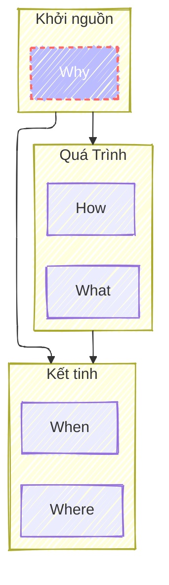

Trước, trong và sau khi học một kiến thức nào đó, nếu tự hỏi cho mình những câu hỏi này cậu sẽ cảm thấy việc học nó có mục đích và có tầng có lớp rõ ràng.

## 1. Why - Khởi nguồn
Why là câu hỏi quan trọng nhất quyết định và kiểm soát tất cả mọi thứ. 

Trước khi học một cái gì đó điều quan trọng nhất luôn là động lực.
- Tại sao mình lại cần học kiến thức này? 
- Nó có giúp ích gì được cho mình hay không?

Ngoài ra câu hỏi Why còn giúp cậu định hướng rõ hơn bản chất, nguồn gốc của kiến thức. 
- Tại sao kiến thức này được tạo ra? 
- Nó tạo ra trong hoàn cảnh thế nào?

## 2. What & How - Quá Trình
Đây là 2 câu hỏi thường sẽ được trả lời trong quá trình tìm hiểu, học kiến thức. Trả lời hai câu này cậu sẽ đi vào chi tiết của kiến thức. Ví dụ như:

- Kiến thức này cần những khái niệm gì?
- Cách thức vận hành như thế nào?
- Làm cách nào để mình có thể áp dụng được nó.
- Điểm mạnh của phương pháp này là gì?
- Phương pháp đang học có điểm yếu là gì?

## 3. When & Where - Kết tinh
Sau khi học xong và hiểu rõ các khái niệm cũng như cách chúng vận hành, nếu cậu không kết tinh là được thì cũng coi là chưa làm chủ kiến thức.

Với hai loại câu hỏi When & Where sẽ đặt ra cho cậu những định hướng cụ thể như:

- Khi nào thì mình sẽ áp dụng được phương pháp này?
- Phương pháp này chỉ phù hợp trong hoàn cảnh nào?

Và khi trả lời được hai loại câu hỏi này thì cậu có thể được coi là chuyên gia trong lĩnh vực chuyên môn của mình.

## 4. Cái nào cần nhớ, cái nào có thể quên
Thực chất cái tốn nhiều công sức nỗ lực nhất (what & how) lại là cái cần quên. Cậu hãy coi What & How  như cuốn từ điển, khi nào thật cần thiết thì lục từ mà tra lại không cần thiết phải học lại một cuốn từ điển làm gì.

Hãy giữ lại các câu hỏi Why, When, Where trong hành lý đi tiếp trên con đường của Đạo của mình. Nó nhẹ nhất nhưng lại là những thứ quý giá nhất.